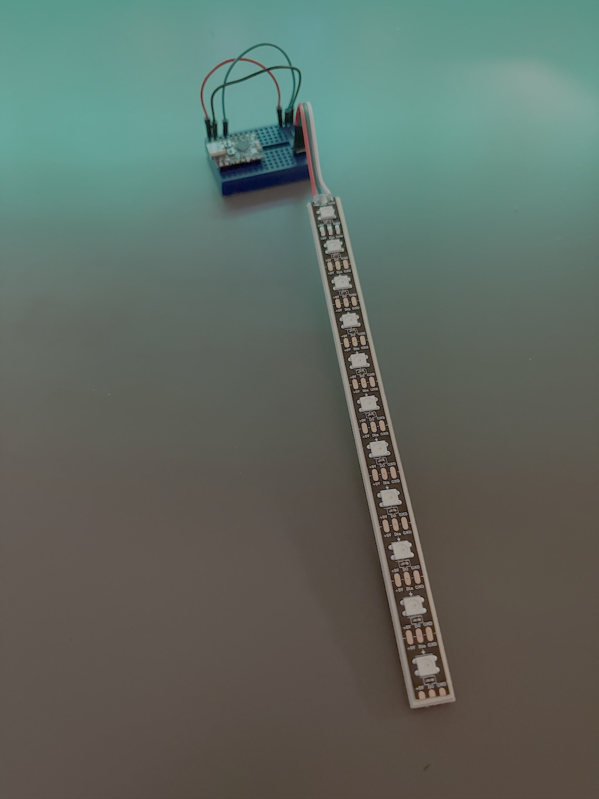

# Programming LEDs — Parts

Kits are **assembled and wired before class** and handed out ready to plug in.
Students bring only a laptop and a USB-C data cable — see
[`STUDENT_GUIDE.md`](STUDENT_GUIDE.md) for what they are told.

## Per student

| Item | Qty | Notes |
|---|---|---|
| ESP32-C3 dev board | 1 | `esp32-c3-devkitm-1` or compatible (Seeed XIAO ESP32C3, ESP32-C3 SuperMini) |
| Half-size or mini breadboard | 1 | Board is pre-seated in it; students never wire from scratch |
| WS2812B strip on a wood backing | 1 | Rigid backing so the strip survives a room full of beginners handling it |
| 3-pin header on the strip's input leads | 1 | Pre-attached, plugs straight into the breadboard |
| Jumper wires, breadboard to header | 3 | +5V, GND, and data to GPIO 4 — pre-wired |

Students supply the laptop and the USB-C cable.

## Why the kits ship pre-wired

The strip's data line is one-directional: each LED keeps the first color it
receives and passes the rest down the chain. Feed the wrong end and nothing
lights, with no error of any kind. Pre-terminating the input end removes the
day's most common silent failure and buys back the wiring time for the parts
of the class students actually remember.

Keep the wiring *visible* rather than hidden — the three-wire story (power,
ground, data) is a teaching point, and students should be able to trace each
wire with a finger.

## Assembly, per kit

1. Mount the strip on the wood backing, input end free.
2. Solder three leads to the strip's `+5V`, `Din`, and `GND` pads and terminate
   them in a 3-pin header.
3. Seat the ESP32-C3 in the breadboard.
4. Jumper the header to the board: `+5V` → 5V, `GND` → GND, `Din` → **GPIO 4**.
5. Power it up and confirm the strip lights before it goes in a kit bag.
6. **Count the LEDs and set `NUM_LEDS` to match**, or leave it deliberately
   wrong and make finding it the room's first exercise — see `CLASS_PLAN.md`.

## Instructor spares

Bring at least 2 of each. Something is always dead on arrival.

| Item | Qty |
|---|---|
| Fully assembled kit | 2 |
| USB-C **data** cable | 4 |
| Loose jumper wires | 10 |
| USB power meter | 1 (optional — makes the current budget discussion real) |

## The cable

Students are asked to bring their own, and some will bring the wrong one.

**Test every spare cable before class.** A charge-only USB cable has power
wires but no data wires, is visually identical to a working one, and accounts
for roughly 70% of "no serial port" failures. Plug each spare into a board and
confirm a serial port appears.

## Not needed for this workshop

Real installations want these; a short strip on a bench does not, and adding
them costs class time. Mention them, do not hand them out:

- **330–470 Ω resistor** in series with the data line — tames reflections on
  longer wire runs.
- **1000 µF capacitor** across 5V and GND at the strip — absorbs the inrush
  when every LED switches on at once.
- **74AHCT125 level shifter** — the ESP32-C3 drives 3.3V into a strip that
  wants 3.5V for a logic high. Out of spec, but reliable at this length. This
  is the real cause of "my strip flickers randomly" in bigger projects.
- **External 5V supply** — needed past roughly 10 LEDs at full brightness, and
  it must share a ground with the board.
